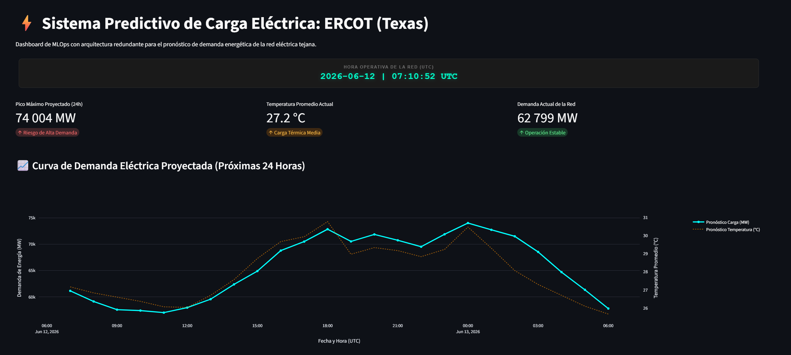
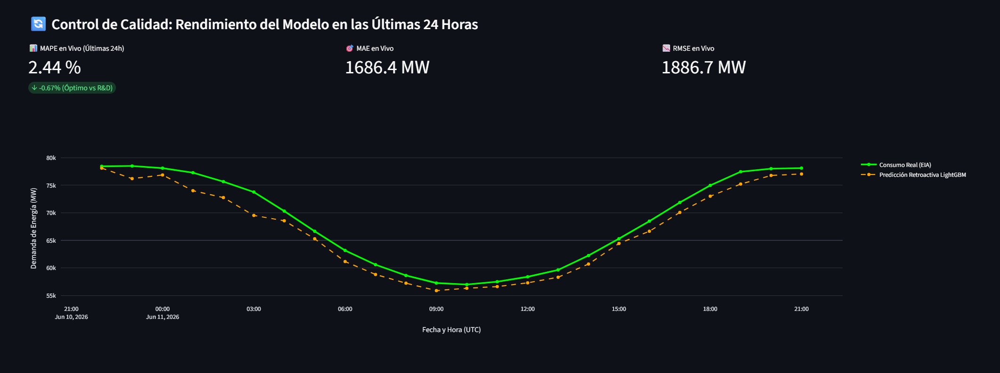
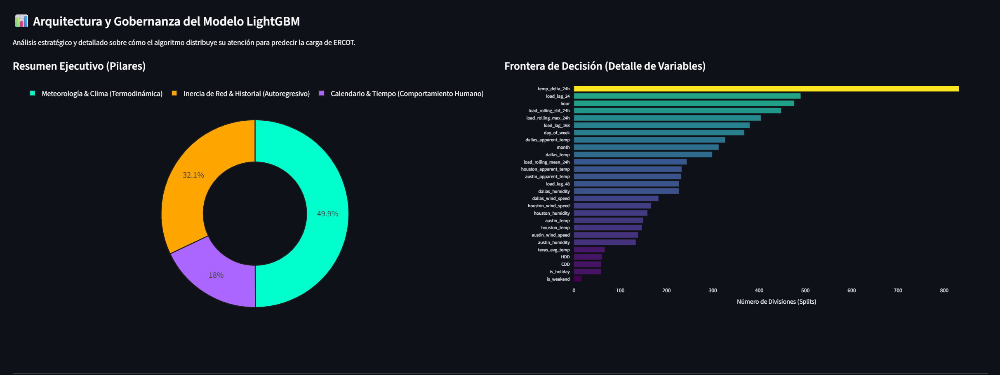
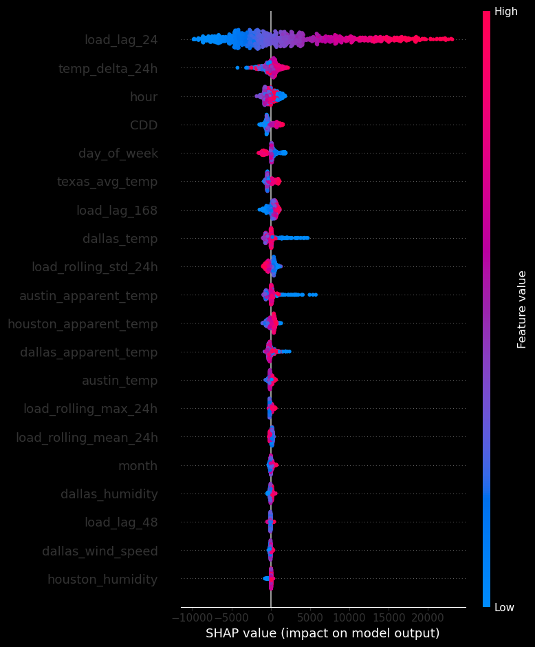
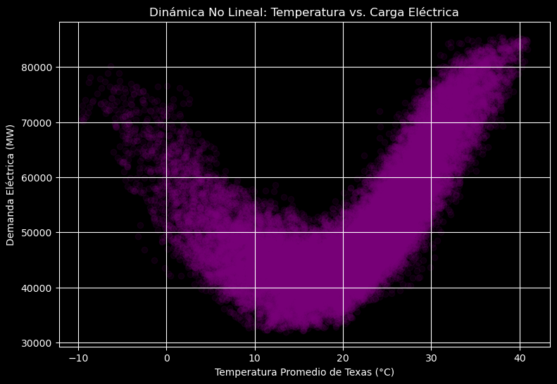

# ⚡ Sistema Predictivo de Carga Eléctrica y Telemetría Operativa: ERCOT (Texas)

> Plataforma completa de MLOps con ingesta asíncrona en tiempo real, modelo autorregresivo-termodinámico para el pronóstico de demanda y monitoreo SCADA del margen de reserva operativa en la red eléctrica de Texas.

[](https://ercot-load-forecasting-by-davidvaac.streamlit.app/)
[](https://www.python.org/)
[](https://lightgbm.readthedocs.io/)
[](https://opensource.org/licenses/MIT)

---

## 📈 Resumen del Proyecto

Este sistema orquesta flujos de datos asíncronos en tiempo real para predecir la demanda de energía de las **próximas 24 horas** en el Operador de Red de Texas (ERCOT) y evaluar de forma dinámica los márgenes de seguridad del estado. Dado que Texas opera como una "isla energética" aislada de las interconexiones nacionales de Estados Unidos, la precisión en el despacho de carga y la visibilidad de las reservas son factores críticos para la estabilidad de la infraestructura y la toma de decisiones financieras.

El motor de inferencia combina variables meteorológicas granulares de los tres nodos de consumo más importantes (**Houston, Dallas y Austin**) procesados mediante un algoritmo de Gradient Boosting (LightGBM) optimizado para series temporales. Además, el sistema consume en vivo el SCADA oficial del estado para calcular la solvencia energética actual y futura.

---

## 🚀 Arquitectura de Ingesta y Resiliencia de Datos (Failover en Cascada)

Para garantizar un Service Level Agreement (**SLA**) continuo de grado industrial, el backend implementa una arquitectura redundante de extracción de datos estructurada en tres canales independientes:

### 📊 1. Canal de Carga Histórica (EIA API)
El sistema extrae la demanda histórica real del estado a través de la API de la **U.S. Energy Information Administration (EIA)**. Este flujo es el corazón de la ingeniería de características, alimentando las variables autorregresivas del modelo (rezagos de 24h/48h/168h y medias móviles) y fungiendo como el *ground-truth* para el cálculo continuo de los residuales de calidad.

### 🌦️ 2. Canal de Ingesta Climatológica
| Nivel | Componente | Tipo | Función |
| :--- | :--- | :--- | :--- |
| **Nivel 1** | **Open-Meteo API** | Fuente Principal | Ingesta horaria en UTC sin límite de créditos de ráfaga. |
| **Nivel 2** | **Visual Crossing API** | Respaldo Comercial | Activación automática ante caídas del Nivel 1. Sincronización absoluta en tiempo Zulu (`Z`). |
| **Nivel 3** | **Semilla Local (CSV)** | Contingencia Offline | Relleno e inferencia segura basada en snapshots históricos si toda la conectividad externa falla. |

### 🔌 3. Canal de Telemetría de Red e Inercia Operativa (Gridstatus)
El sistema se integra directamente con los servidores de **ERCOT mediante la API de Gridstatus** para extraer dos fuentes de datos en tiempo real:

1. **`get_real_time_system_conditions()`**: Captura la demanda y capacidad real instantánea de la red para alimentar las métricas en vivo.
2. **`get_capacity_forecast()`**: Extrae el pronóstico de capacidad disponible publicada por los operadores físicos.

#### 🛠️ Pipeline de Ingeniería de Datos en Producción:
* **Downsampling de Granularidad:** La API de la red reporta datos cada 5 minutos. El backend ejecuta un remuestreo por hora (`.resample('h').mean()`) para acoplar la capacidad con la frecuencia horaria del modelo predictivo.
* **Manejo de Asincronía Temporal (Left Join + Ffill):** Dado que ERCOT publica la capacidad proyectada únicamente para las horas inmediatas del ciclo operativo (creando ventanas flotantes de 4 a 6 horas), el sistema realiza un `left join` sobre las 24 horas predichas por el LightGBM y aplica **Inercia Operativa** mediante un *Forward-fill* estadístico para completar el horizonte completo del día.
* **Aislamiento Sincrónico de Husos Horarios:** El backend procesa, une y calcula las matrices vectoriales estrictamente en tiempo **UTC** para blindar los cálculos contra cambios de horario estacional (DST). Justo antes del renderizado, el índice se convierte a la zona horaria nativa de la infraestructura (`US/Central`) y se remueve la etiqueta de zona para garantizar compatibilidad absoluta con Plotly.

---

## 🖥️ Interfaz Operativa y Matriz de Control de Riesgo

La interfaz de usuario está diseñada bajo estándares SCADA, organizando los componentes visuales en layouts simétricos "en espejo" para eliminar la fatiga cognitiva del operador:

* 📊 **[Acceso al Dashboard en Vivo](https://ercot-load-forecasting-by-davidvaac.streamlit.app/)**

### 1. Panel de Control Principal e Inferencia de Futuro
Presenta la sincronización maestra mediante un reloj digital sincronizado dinámicamente en **Hora Local de Texas (Central Time)** mediante JavaScript. Despliega un Grid de KPIs 4x2 simétrico:

* **Fila de Demanda y Clima:** Controla la carga e impacto térmico real y proyectado.
* **Fila de Solvencia Energética (Baterías Metafóricas):** Implementa indicadores dinámicos (`🔋 Reserva Actual` y `🪫 Mín Reserva 24h`) calculados en porcentaje de respaldo sobre la carga.
* **Semáforos Sincronizados de Regla de Negocio:** La alerta de la Demanda Actual está indexada matemáticamente al porcentaje de la Reserva Actual (si la reserva cae por debajo del 20% o 13.75%, ambas tarjetas se encienden en naranja o rojo simultáneamente).

> 🔋 **Reserva Actual (%)** = [(Capacidad Disponible Real - Demanda Real) / Demanda Real] * 100
>
> 🪫 **Mín Reserva 24h (%)** = MIN([(Capacidad Disponible Predicha - Demanda Predicha) / Demanda Predicha] * 100)


*Figura 1: Cabecera operativa, métricas termodinámicas en tiempo real con conversión a huso horario local y curvas vectoriales de demanda y reserva proyectada.*

### 2. Auditoría de Modelos y Benchmarking Competitivo (MLOps)
Evalúa de forma retroactiva las últimas 24 horas ejecutando un **Benchmarking Competitivo** en tiempo real. A través de un Cuadro de Honor SCADA simétrico y un gráfico de triple trazo, el sistema enfrenta las predicciones del modelo LightGBM directamente contra el pronóstico oficial del Operador Central (ERCOT ISO), revelando de forma visual y numérica qué algoritmo mitigó mejor la incertidumbre de la red.

Para garantizar la neutralidad de la auditoría, ambos modelos son evaluados por un motor de **semáforos simétricos invariantes**, asegurando que ambos se iluminen en verde, naranja o rojo bajo las mismas reglas estadísticas.


*Figura 2: Matriz de auditoría competitiva contrastando el rendimiento del LightGBM vs. ERCOT ISO en tiempo real.*

#### 📔 Diccionario de Control SCADA (Los 4 Pilares Estadísticos):
1. **📊 MAPE (Mean Absolute Percentage Error):** Mide la magnitud promedio del error en términos relativos. Su delta reactivo permite visualizar instantáneamente si el algoritmo mejora (verde) o degrada (rojo) el benchmark base (3.11%).
2. **🎯 MAE (Mean Absolute Error):** Expresa la desviación promedio directamente en volumen físico de potencia (**MW**), exponiendo la magnitud real del costo por error en el despacho.
3. **⚖️ MBE (Mean Bias Error):** Registra la dirección del sesgo sistemático promedio. Permite dictaminar si el modelo asume posiciones de riesgo por **Subestimación** (Riesgo de apagón) o **Sobreestimación** (Reserva ociosa injustificada).
4. **🔄 Skewness (Coeficiente de Asimetría):** Analiza la simetría de la distribución de los residuales. Funciona como un monitor avanzado de **Riesgo de Cola Pesada**, advirtiendo de forma preventiva si los algoritmos fallan de manera desproporcionada durante los picos extremos de calor o los valles de madrugada.

### 3. Gobernanza del Modelo e Interpretabilidad
Desglosa la lógica interna de toma de decisiones del árbol del LightGBM para eliminar el efecto de "caja negra", facilitando auditorías técnicas, revisiones de sesgo algorítmico y presentaciones ejecutivas ante tomadores de decisiones.


*Figura 3: Contribución relativa por categoría macro de ingeniería de variables y peso detallado por split estructural.*

<div align="center">
  
</div>
*Figura 4: Análisis de explicabilidad local y global mediante valores SHAP para auditar el impacto marginal de los predictores.*

---

## 🔬 Análisis Estadístico & Ciencia de Datos (R&D)

El proceso de investigación y modelado se encuentra documentado de forma exhaustiva, destacando por alcanzar un **desempeño de élite comercial**. El algoritmo fue entrenado con más de 25,000 registros históricos (2022-2024) y sometido a pruebas de estrés ante un año ciego de evaluación.

### 🏆 Rendimiento del Modelo
* **Fase de R&D (Validación Año Ciego 2025):** MAPE base de **3.11%**.
* **Entorno de Producción (Telemetría en Vivo):** MAPE sostenido **< 2.0%** con una varianza explicada ($R^2$) de **0.97**.

Estos resultados demuestran un ajuste termodinámico y autorregresivo excepcional, superando de forma consistente el modelo operativo de ERCOT en pronósticos de series temporales *day-ahead* (día en adelanto).

* 📓 **[Notebook de Investigación y Modelado](https://github.com/DavidVaAc/ercot-load-forecasting/blob/main/notebooks/electricity_demand.ipynb)**

### Hallazgos Clave de Investigación:
* **La Curva Térmica en U:** Se identificó una respuesta parabólica no lineal entre la carga y la temperatura promedio. La infraestructura se estresa significativamente por debajo de los **12°C** (encendido de calefacción eléctrica residencial) y de forma crítica por encima de los **34°C** (operación continua de compresores HVAC).
* **Derivadas Térmicas:** La ingeniería de características demostró que la variable `temp_delta_24h` (tasa de cambio térmico respecto al día anterior) es el predictor con mayor cantidad de divisiones (*splits*) en las ramas del LightGBM, capturando con éxito el efecto de retención y acumulación de calor en las estructuras urbanas.

<div align="center">
  
</div>
*Figura 5: Respuesta termodinámica del consumo de la red de Texas frente a oscilaciones de temperatura ambiente.*

---

## 🛠️ Tecnologías Utilizadas

* **Modelado & ML:** LightGBM, Scikit-Learn
* **Procesamiento de Datos:** Pandas (Remuestreos vectoriales, Timezones), NumPy
* **Telemetría e Ingesta:** Gridstatus API, Requests Gateway, REST (EIA & Open-Meteo)
* **Zonas Horarias de Contenedor:** Pytz, Tzdata (Respaldo para Linux Unix-kernel mínimos)
* **Visualización:** Plotly Graph Objects (Doble eje Y, layouts multi-trazo), Matplotlib, Seaborn
* **UI & Frontend:** Streamlit, Streamlit Components (HTML5/JS Injection para Reloj SCADA)

---

## 🧠 Limitaciones del Modelo & Siguientes Pasos (Roadmap)

Todo sistema en producción real opera bajo restricciones de entorno. Para mantener el principio de mejora continua de MLOps, se identifican las siguientes fronteras de desarrollo:

### Limitaciones Actuales:
1. **Reducción Meteorológica por Proxies:** El modelo utiliza los centros climáticos de Houston, Dallas y Austin como representación del estado completo. Variaciones climatológicas severas en nodos de alta densidad industrial rural (como los distritos petroleros del Permian Basin) podrían inducir microdesviaciones volumétricas.
2. **Naturaleza Determinista:** Actualmente el sistema genera un pronóstico puntual (*point forecast*). En momentos de estrés crítico de red, el despacho de carga se beneficia significativamente de esquemas probabilísticos que integren bandas de incertidumbre.

### Roadmap Técnico (Próximos Sprints):
* **Inclusión de Generación Renovable Activa:** Integrar las curvas en tiempo real de capacidad eólica e hidroeléctrica de Texas como variables exógenas para migrar del modelado de carga bruta al pronóstico de **Demanda Neta**.
* **Infraestructura de Reentrenamiento Automatizado (CI/CD):** Configurar un flujo de GitHub Actions que ejecute un script mensual automático de reentrenamiento, gatillado únicamente si el monitor del MAPE en producción se mantiene en terreno rojo durante más de 72 horas consecutivas.

---

## ⚙️ Instalación y Reproducción Local

Si deseas ejecutar este dashboard de forma local para desarrollo o auditorías, sigue estos pasos en tu terminal:

1. **Clonar el repositorio:**
   ```bash
   git clone [https://github.com/DavidVaAc/ercot-load-forecasting.git](https://github.com/DavidVaAc/ercot-load-forecasting.git)
   cd ercot-load-forecasting
    ```

2. **Instalar dependencias:**
    ```bash
    pip install -r requirements.txt

    ```


3. **Configurar credenciales locales:**
    Crea una carpeta llamada `.streamlit/` y dentro de ella un archivo `secrets.toml`. Agrega tus API Keys correspondientes:
    ```toml
    EIA_API_KEY = "tu_clave_de_la_eia_aqui"
    VISUAL_CROSSING_KEY = "tu_clave_de_visual_crossing_aqui"

    ```


4. **Ejecutar el dashboard:**
    ```bash
    streamlit run app.py

    ```

## 📁 Estructura del Repositorio

La arquitectura del proyecto está organizada de forma modular para separar estrictamente la etapa de investigación (*R&D*) del despliegue operativo en producción (*Deployment*):

```text
ercot-load-forecasting/
├── 📁 .streamlit/
│   └── secrets.toml             # Configuración y llaves de API locales (Excluido en Git)
├── 📁 data/
│   ├── modelo_final_ercot_lgb.json  # Binario serializado del modelo LightGBM
│   ├── backup_live_clima.csv      # Snapshot de contingencia para inferencia offline
│   ├── backup_live_eia.csv        # Snapshot de contingencia para inferencia offline
│   ├── ercot_load_2022_2025_static.csv  # Dataset histórico completo para entrenamiento
│   └── texas_weather_2022_2025_static.csv # Dataset histórico completo para entrenamiento
├── 📁 images/
│   ├── dashb_panel.png          # Capturas de pantalla del panel principal
│   ├── dashb_quality.png        # Capturas de pantalla de la matriz de auditoría competitiva
│   ├── dashb_modelarq.png       # Gráficos de importancia de variables
│   ├── u_graph.png              # Gráfico de la curva termodinámica en U
│   └── shap.png                 # Diagrama de abejas de valores SHAP
├── 📁 notebooks/
│   ├── electricity_demand.ipynb # Notebook de R&D, entrenamiento y explicabilidad SHAP
│   ├── EIA_API.ipynb            # Validación y pruebas de esquemas sobre la API de la EIA
│   └── OPEN_METEO_API.ipynb     # Validación y pruebas de carga sobre la API de Open-Meteo
├── .gitignore                   # Exclusión de archivos locales y entornos virtuales
├── app.py                       # Código fuente del Dashboard de producción en Streamlit
├── README.md                    # Documentación técnica principal del sistema (Este archivo)
├── requirements.txt             # Dependencias declarativas mapeadas para el contenedor en la nube
├── LICENSE                      # Licencia legal de distribución del proyecto
└── seed_backup.py               # Script auxiliar para inicialización de respaldos

```

---

## 👨‍💻 Autor

**David Fernando Valle Acosta** *Físico (UNAM) & Científico de Datos (TripleTen)*

* 💼 [Portafolio](https://davidvaac.github.io/DavidVaAc/#)
* 🌐 [LinkedIn](https://linkedin.com/in/david-fernando-valle-acosta)
* 📋 [Curriculum](https://drive.google.com/file/d/1qiQUyAmt3KGcFhBQ88-LPGflgPpHGs1m/view?usp=sharing)
* ✉️ [Email](https://www.google.com/search?q=mailto%3Adavidfervalle%40gmail.com)

---

## 📄 Licencia

Este proyecto está bajo la Licencia MIT.